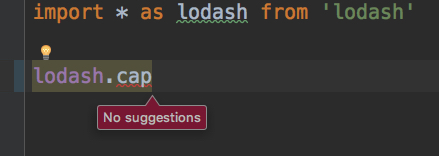

WebStorm TypeScript Lodash Completion Issue Demo
================================================

Can't find a way to make webstorm show lodash completion for typescript project with `tsconfig.json`.

Webstorm Verion
---------------

Latest webstorm version (till 2018-08-26):

```
WebStorm 2018.2.2
Build #WS-182.4129.32, built on August 21, 2018
Licensed to WebStorm Evaluator
Expiration date: September 3, 2018
JRE: 1.8.0_152-release-1248-b8 x86_64
JVM: OpenJDK 64-Bit Server VM by JetBrains s.r.o
macOS 10.13.3
```

Project WITHOUT tsconfig.json
-----------------------------

If there is no `tsconfig.json` file (you can delete/rename it from this project),
we can configure webstorm to complete lodash as following steps:


Make sure the `@types/lodash` library is added:


At the mean time, in your typescript file, you should do:

```
import * as lodash from 'lodash'
```

You will get lodash completion:


### avoid `import * as _`

If you import lodash as `_`

```
import * as _ from 'lodash'
```

the completion will not work:


The reason is webstorm will treat the `_` as a `const` or `namespace` whose name is `_`:


So we need a different name.

Project WITH tsconfig.json
--------------------------

Now let's add the file `tsconfig.json`, and give it empty configuration `{}`.

You will find the lodash completion is broken, there is no completion:



No matter how I configure the `tsconfig.json` or webstorm itself, I can't find a way to make the completion work again.

What about VSCODE?
------------------

I use vscode to open this project. Without ANY configuration, the completion is working perfect.

