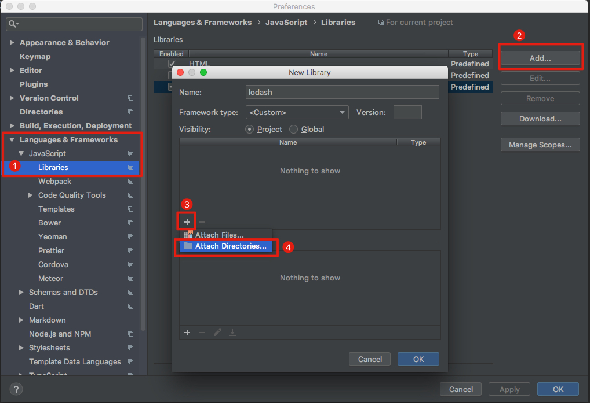
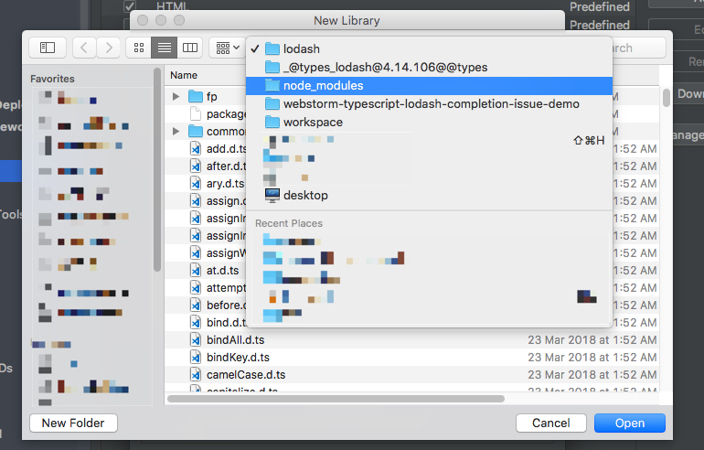
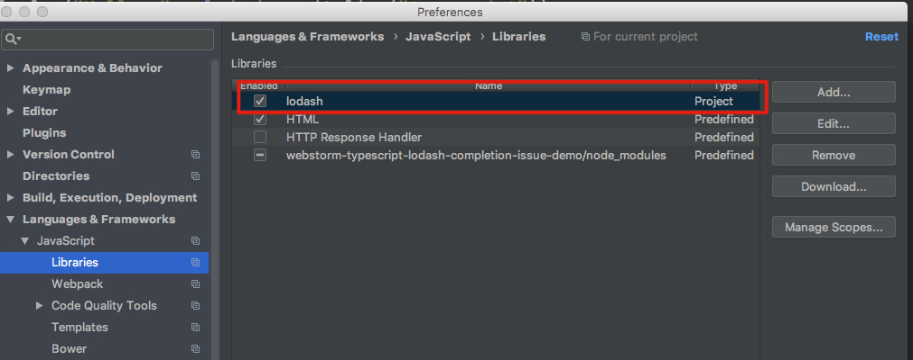
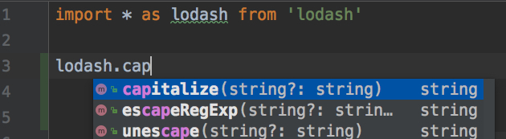

WebStorm TypeScript Lodash Completion Issue Demo
================================================

<s>Can't find a way to make webstorm show lodash completion for typescript project with `tsconfig.json`.</s>

Update: found a way, but need some boring manual work. (Looking for a simpler way)

Webstorm Verion
---------------

Latest webstorm version (till 2018-08-26):

```
WebStorm 2018.2.2
Build #WS-182.4129.32, built on August 21, 2018
Licensed to WebStorm Evaluator
Expiration date: September 3, 2018
JRE: 1.8.0_152-release-1248-b8 x86_64
JVM: OpenJDK 64-Bit Server VM by JetBrains s.r.o
macOS 10.13.3
```

Configuration Webstorm
----------------------









It works but we have to do this manually, which is quite boring.

What about VSCODE?
------------------

I use vscode to open this project. Without ANY configuration, the completion is working perfect.


