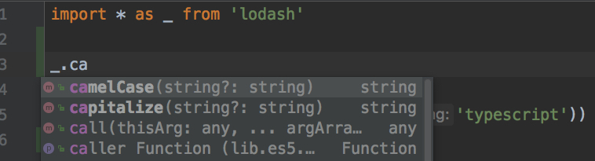
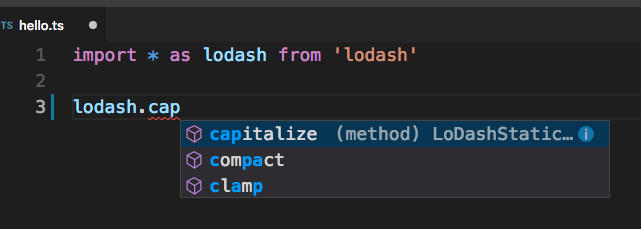

WebStorm TypeScript Lodash Completion Issue Demo
================================================

<s>Can't find a way to make webstorm show lodash completion for typescript project with `tsconfig.json`.</s>

Update:

- <s>[manually config, but can't work with `tsconfig.json`](./webstorm-config-global-library.md)</s>
- <s>[can work with `tsconfig.json`, but need some boring manual work.](./webstorm-config-project-library.md)</s>
- found the real problem!

The real problem
----------------

Finally, I found Webstorm can complete lodash perfectly out of box, without any config.



The problem is I was using `cnpm` to install the dependencies (which uses Chinese taobao npm registry, is much faster for me).
But seems like Webstorm doesn't work well with the `node_modules` files it downloads.

Now I use `npm install`, everything works.

Versions I use:

- `npm`: `6.3.0`
- `cnpm`: latest `6.0.0`, with internal `npm 6.4.0`

Version details are here: <./npm-issue-data/README.md>, and I also packaged the `node_modules` they downloaded:

- `npm-issue-data/cnpm-6.0.0-node_modules.tar.gz`
- `npm-issue-data/npm-6.3.0-node_modules.tar.gz`

Suggestions
-----------

Avoid using `cnpm` if you found something strange.

If you want to download dependencies from some mirror faster, you can use something like:

```
npm --registry https://registry.npm.taobao.org install
```

Which works well with Webstorm.

If you want to type less, you can create an alias `cnpm` for `npm --registry https://registry.npm.taobao.org`

Webstorm Version
----------------

Latest webstorm version (till 2018-08-26):

```
WebStorm 2018.2.2
Build #WS-182.4129.32, built on August 21, 2018
Licensed to WebStorm Evaluator
Expiration date: September 3, 2018
JRE: 1.8.0_152-release-1248-b8 x86_64
JVM: OpenJDK 64-Bit Server VM by JetBrains s.r.o
macOS 10.13.3
```

What about VSCODE?
------------------

I use vscode to open this project. Without any configuration, the completion is also working perfect.


