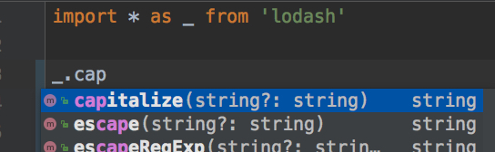

Configuration Webstorm
----------------------

Install dependencies first:

```
npm install
```

Then add the `node_modules/@types/lodash` as a javascript library to current project:


Choose the `node_modules/@types/lodash` directory of current project:


Make sure the `lodash` library is added:


Try:


It also works if we import lodash as `_`:



It works but we have to do this manually, which is quite boring.